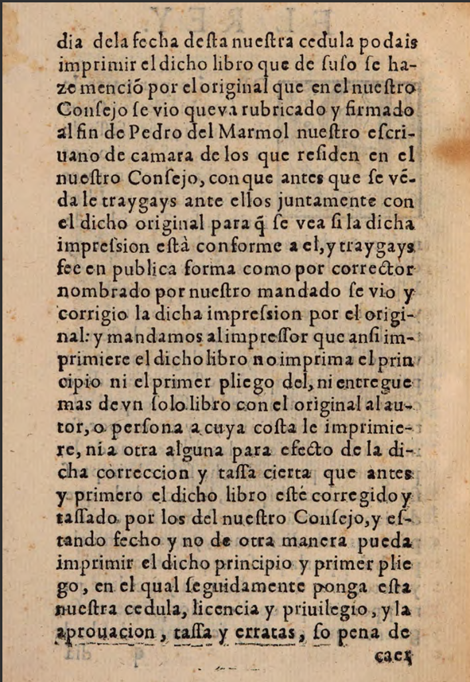
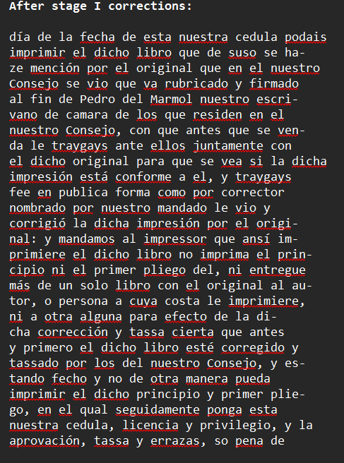
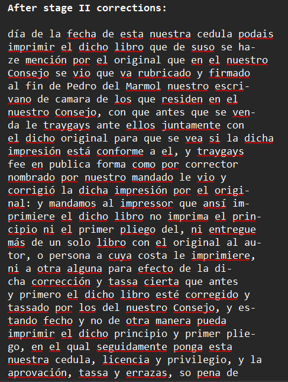
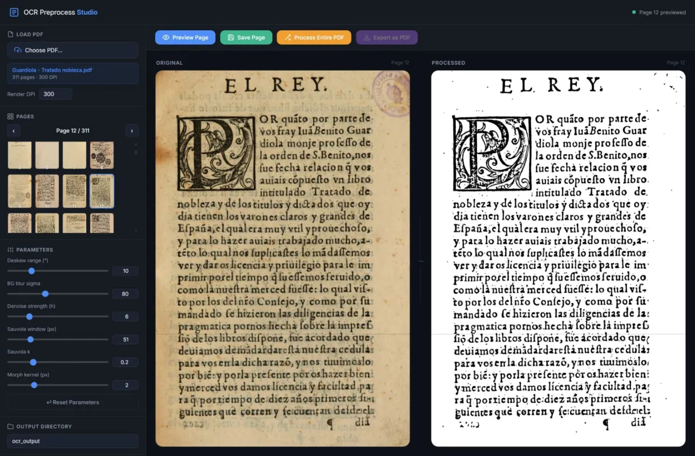
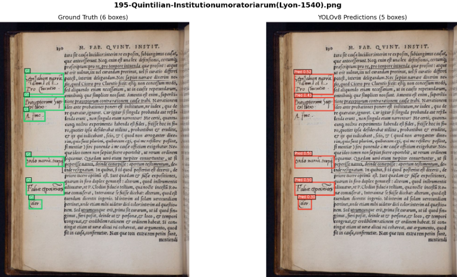

# RenAIssance Assignment 2026 & GSoC Tasks

This repository contains the complete implementation for the OCR, Preprocessing, and Marginalia Detection tasks for the RenAIssance Assignment 2026 and GSoC test submissions. It is organized into three main sub-projects.

---

## 1. GSoC_Prelimnary_OCR_Pipeline

This folder contains a complete, robust OCR pipeline that takes raw scanned historical documents and produces highly accurate digital text using a multi-stage AI approach.

### Approach
1. **Localization (Detectron2):** We use a Mask R-CNN model to detect and crop individual lines of text.
2. **Recognition (TrOCR):** Each cropped snippet is passed through the Transformer-based TrOCR model to convert the cursive/archaic visual shapes into raw digital text.
3. **Proofreading (Gemini LLM):** The raw OCR output is fed to an LLM (Google Gemini) acting as a smart proofreader to fix typos and punctuation anomalies without altering the historical context.
4. **Visual Verification (Gemini VLM):** A final Vision-Language Model natively compares the original image snippet with the LLM-corrected text to catch stubborn hallucinations or severe errors, ensuring perfect alignment.

### Key Metrics Achieved
- **Avg CER (Character Error Rate):** `4.6%`
- **Avg WER (Word Error Rate):** `18.3%`
- **Avg BLEU Score:** `0.75`
- **Error Reduction (vs Raw OCR):** `~57% ↓ CER`

### Parameters
- **Text Localization:** Mask R-CNN (Detectron2)
- **OCR Engine:** microsoft/trocr-base-handwritten (or large variant)
- **Post-Correction / VLM:** `gemini-1.5-pro` / `gemini-1.5-flash`

### Results Overview

| Original Image | LLM Corrected Text | VLM Verified Text |
| :---: | :---: | :---: |
| ** | ** | ** |

---

## 2. GSoC2026_Preprocess

This folder provides a polished, responsive web application for interactively preprocessing scanned PDF pages prior to running them through the OCR pipeline.

### Approach
A full-stack application with a **FastAPI** backend and dynamic **Vanilla JS** frontend. It converts PDFs to images, caches them in memory, and allows users to tune preprocessing parameters with real-time feedback (debounced to 320ms to prevent server flooding). The pipeline mathematically cleans the page via illumination normalization, Non-Local Means (NLM) denoising, Sauvola local thresholding, and morphological cleanup.

### Parameters
- **DPI:** `300` (render resolution)
- **Deskew Range:** `10°` (max absolute correction)
- **Background Blur Sigma:** `80` (Gaussian normalization)
- **Denoise Strength (h):** `6` (NLM filter)
- **Sauvola Window:** `51px` (neighborhood size)
- **Sauvola Constant (k):** `0.2`
- **Morph Kernel:** `2px` (opening cleanup)

### Preprocessing Interface

**

---

## 3. GSoC_Marginalia_Detection

This folder contains the reproduction and fine-tuning scripts for detecting handwritten notes (marginalia) in the margins of early modern books.

### Approach
We fine-tuned **YOLOv8s** (Ultralytics) on the `YOLOv7_85-15` dataset (sourced from Archaeology of Reading, UCLA Clark Library, and NLS Chapbooks). The dataset consists of 1,585 training images (with augmentations like saturation, noise, illumination, and contrast variants), 39 validation images, and 17 test images. Given the robustness of YOLOv8, we trained a lightweight model locally to demonstrate the pipeline.

### Key Metrics Achieved
- **Test mAP@50:** `0.519` (achieved in just 1 epoch of training!)
- **Precision:** `0.551`
- **Recall:** `0.482`

### Parameters
- **Architecture:** YOLOv8s (`yolov8s.pt`)
- **Image Size:** `640px`
- **Batch Size:** `8`
- **Epochs:** `1` (Demo Run)
- **Optimizer:** `AdamW` (lr: `0.002`, momentum: `0.9`)

### Marginalia Detection Results

**

---
